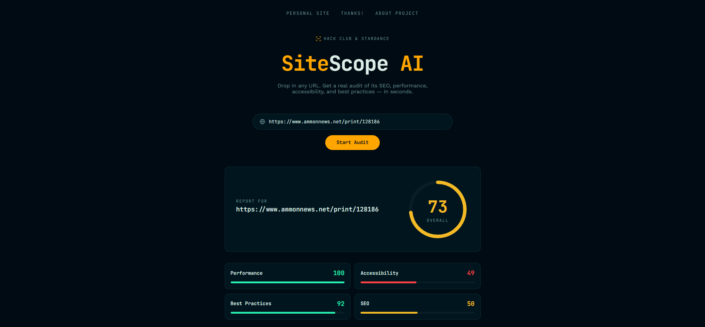

# SiteScope AI

SiteScope AI is an open-source web app that audits any website's performance, SEO, accessibility, and best practices using Google PageSpeed Insights (Lighthouse), then uses AI to turn the raw technical findings into plain-language explanations and concrete fixes.

🔗 **Live demo:** [sitescope-ai.netlify.app](https://sitescope-ai.netlify.app/)

Hi! If you came here from Stardance, thanks for trying it out, and I'd really appreciate a rating. 🙂



## Why I built this

I didn't invent website auditing because PageSpeed Insights already does the heavy lifting. What I built on top of it is the part that was missing for me: PageSpeed gives you a wall of technical findings, but not everyone knows what "render-blocking resources" or "missing meta description" actually means, why it matters, or what to do about it. SiteScope AI takes that raw output and explains it in plain language, with a concrete next step for each issue.

I'm building this as an open-source project to learn more about APIs, backend development, AI integration, and real-world software engineering and eventually to use it in my own freelance web design work.

## How it works

1. You enter a URL.
2. The backend sends it to the Google PageSpeed Insights API, which runs a full Lighthouse audit.
3. The response is parsed down to just the scores and the findings that actually need fixing.
4. Each finding is sent to Gemini, which returns a short explanation, why it matters, and how to fix it.
5. You get a clean report: an overall score, a breakdown by category, and a findings list with real explanations instead of raw Lighthouse jargon.

## Tech stack

- **Backend:** Python, FastAPI, httpx, Pydantic
- **Frontend:** Vanilla HTML/CSS/JS - no framework
- **APIs:** Google PageSpeed Insights API v5, Google Gemini API (`gemini-3.6-flash`)
- **Hosting:** Frontend on Netlify, backend on [Hack Club Nest](https://nest.hackclub.com/)

## Running it locally

**Backend:**

```bash
cd backend
python -m venv venv
source venv/bin/activate  # on Windows: venv\Scripts\activate
pip install -r requirements.txt
```

Create a `backend/.env` file with your own API keys:

```
PAGESPEED_API_KEY=your_key_here
GEMINI_API_KEY=your_key_here
```

Then start the server:

```bash
uvicorn main:app --reload
```

**Frontend:**

Open `frontend/index.html` directly, or serve the `frontend/` folder with any static file server. Note: `script.js` points `API_URL` at the deployed backend by default change it to `http://localhost:8000/api/audit` if you want the frontend to talk to your local backend instead.

## Known limitations

- Backend hosting (Hack Club Nest) is a shared, free platform that can occasionally have downtime outside of my control. If an audit fails, waiting a minute and retrying usually works.
- Auditing very large or heavy websites can take longer than usual and may time out. Lighter sites (e.g. `example.com`) are more reliable for a quick demo.
- If the AI explanation step fails or times out, the app still returns the audit it just falls back to the plain PageSpeed description for that finding instead of an AI-written one.

## Feedback

This project is still actively evolving. Bug reports, ideas, and general feedback are very welcome, feel free to open an issue on GitHub.

## Acknowledgments

Built by Eugene Zavirukha for Hack Club Stardance. Debugging and architecture decisions (especially around hosting and async/timeout handling) were worked through with help from **Claude Sonnet 5** (Anthropic).

---

Licensed under MIT — see [LICENSE](./LICENSE).